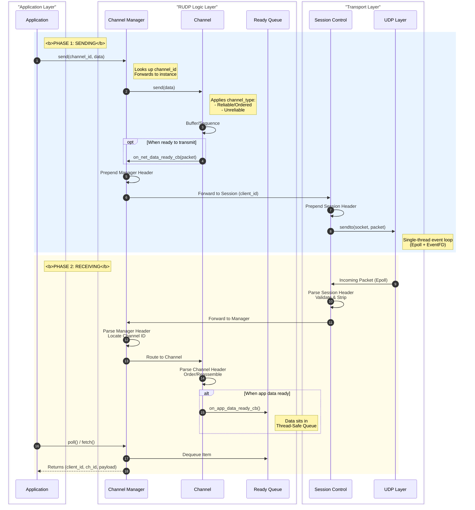

# RUDP — Multi-Channel QUIC-Inspired Reliable UDP Transport (C++)

RUDP is a high-performance, user-space transport protocol built on top of UDP.
It provides reliability, ordering, and multiplexing **without head-of-line blocking**, targeting low-latency C++ systems.

The design is inspired by QUIC’s multi-stream model and TCP’s reliability mechanisms, while remaining minimal, explicit, and debuggable.

---

## Benchmarks

**Test duration:** 10 seconds  
**Baseline:** TCP  
**Network simulation:** tc netem

| Scenario | TCP Speed (MB/s) | RUDP Speed (MB/s) | Winner |
|--------|------------------|---------------------|--------|
| Ideal Localhost | 2747.88 | 1236.31 | TCP |
| Spotty WiFi (1% loss) | 716.35 | 902.59 | RUDP |
| Cross Country (50ms RTT) | 44.93 | 402.28 | RUDP |
| Congestion (5% loss) | 54.25 | 1171.66 | RUDP |
| Loss + Latency | 8.09 | 387.53 | RUDP |

### Observation

- TCP performs best on ideal networks.
- RUDP significantly outperforms TCP under packet loss, latency, and congestion.

---

## Motivation

TCP:
- Suffers from head-of-line blocking
- Couples all application data into a single congestion domain
- Pushes transport logic into the kernel

UDP:
- Low latency
- No reliability, ordering, or flow control

RUDP implements a **user-space transport layer** that supports multiple independent channels with configurable delivery semantics.

---

## Design Goals

- Multiple independent logical channels over one UDP socket
- Per-channel delivery semantics
- No head-of-line blocking across channels
- Zero-copy data path
- Single-threaded epoll-driven core
- Predictable behavior under adverse network conditions

---

## Channel Model

```cpp
enum class channel_type : uint16_t {
    RELIABLE_ORDERED_CHANNEL = 0,
    ORDERED_UNRELIABLE_CHANNEL = 1,
    UNORDERED_UNRELIABLE_CHANNEL = 2,
};
```

Each channel:

- Has a fixed channel ID and type
- Operates independently
- Can make progress regardless of other channel state

## 🏗️ Architecture Overview

The system follows a strict vertical hierarchy, designed to decouple high-level application logic from low-level network transport. Data flows from the Application down to the raw UDP socket through a series of specialized managers.

### System Flow Diagram


## Connection Model

- No explicit handshake
- Connection establishment embedded in the first data packet
- Channel configuration is fixed and pre-agreed
- Clients can send data immediately
- Clean teardown via a minimal per-client state machine

## Channel Design

The reliable ordered channel is TCP-like:
- Sliding send and receive windows
- ACK-based loss detection
- Retransmissions via a global timer mechanism
- Flow control inspired by Clark’s algorithm and Nagle-style batching

Unreliable channels:
- Do not retransmit
- Optionally enforce ordering only

## Event Loop and Concurrency Model

- Single core thread
- epoll for UDP I/O
- Timers merged with I/O using eventfd
- Thread-safe API for application interaction
- The hot path is intentionally allocation-free and low-lock.

## Zero-Copy and Memory Management

- Packet buffers allocated using a custom slab allocator
- No intermediate copies across protocol layers
- Valgrind profiling shows allocator does not appear in top cost centers
- Slab allocator repository: [https://github.com/VishwajeetSinghParihar750/slabAllocator](https://github.com/VishwajeetSinghParihar750/slabAllocator)

## Build and Run
```bash
$ g++ -O3 -std=c++20 benchmark.cpp -o run_tests
$ ./run_tests
```

## Project Status

Feature-complete for current goals.

Future work intentionally deferred:
- Advanced congestion control 
- Stream prioritization
- Encryption
- Slab Allocator use throughout application
- Kernel-bypass backends

## What This Project Demonstrates

- Transport-layer protocol engineering
- Multi-stream design without head-of-line blocking
- Event-driven epoll-based systems
- Zero-copy data paths
- Custom memory allocation
- Performance analysis under real network conditions

